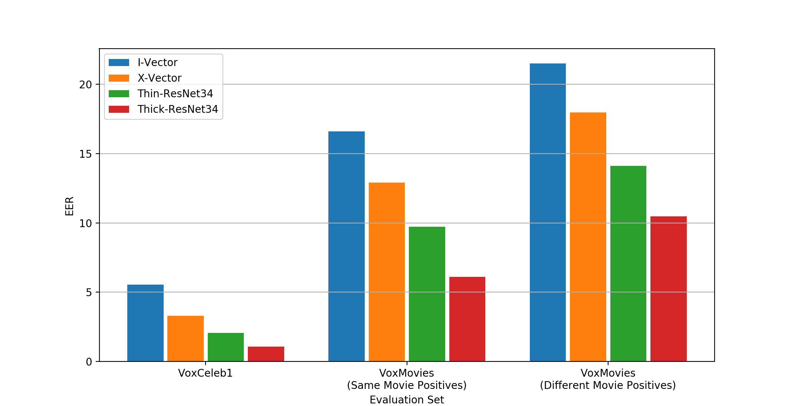

# Useful Commands & Python plots
A growing list of useful commands that I have Google'd too many times...

- /plots contains scripts for specific python plots

# FFMPEG 

- cropping a video, starting from top left corner (0,0)

*ffmpeg -i in.mp4 -filter:v "crop=out_w:out_h\:0:0" out.mp4*

- convert MKV file to MP4

*ffmpeg -i in.mkv -c copy -c:a aac out.mp4*

- cut an mp4 of length "duration" starting from time "start" (seconds)

*ffmpeg -i in.mp4 -ss start -t duration -async 1 out.mp4*

- resize an mp4 

*ffmpeg -i in.mp4 -s 720x480 -c:a copy out.mp4*

- extract a frame at a specific time code

*"ffmpeg -i "+input_video+" -ss "+time_code+" -frames:v 1 " + output_path*
(but for way quicker: import mmcv; video = mmcv.VideoReader(input_video); image = video[int(frame_ind)] )

# LaTeX

- order the references (e.g. [2,1,6] --> [1,2,6])

*\usepackage[numbers,sort]{natbib}*

# Command Line

- recursively count all files in directory 

*find . -type f | wc -l*

- quickly check size of directories in current directory

*for i in `ls ` ; do nice du -sh $i ; done*

- untar a tar.gz into current directory

*tar -xzvf file.tar.gz*

- recursively search for string in files

*grep -rnw '/path/to/somewhere/' -e 'pattern'*

# Python

## OpenCV

- Draw a rectangle on an image

*image = cv2.rectangle(image, (ROI[0], ROI[1]), (ROI[2], ROI[3]), colour, line_width)*

## Other

- get a timecode string from number of seconds. i.e. 25.8 -> '0:00:25.800'

*import datetime; print(str(datetime.timedelta(seconds=25.8)))*

# Scripts for python plots

*plots/multiple_bar_chart.py*

